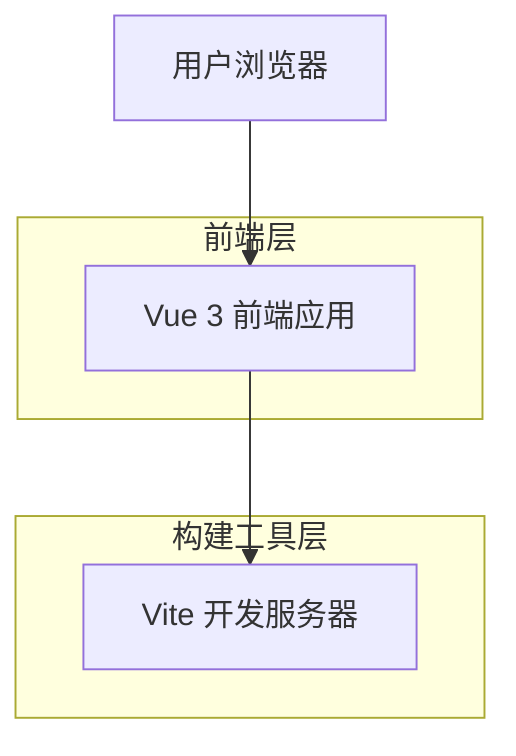

## 1. 架构设计



## 2. 技术描述

- **前端框架**: Vue 3@3.3 + Composition API
- **构建工具**: Vite@4.4
- **样式框架**: Tailwind CSS@3.3
- **初始化工具**: vite-init
- **后端**: 无（纯前端项目）

## 3. 路由定义

| 路由 | 用途 |
|-------|---------|
| / | 首页，展示核心功能和导航 |
| /about | 关于页面，展示项目介绍 |
| /contact | 联系页面，提供联系表单 |

## 4. 组件架构

### 4.1 核心组件

```typescript
// 基础组件结构
interface BaseComponent {
  name: string
  props?: Record<string, any>
  emits?: string[]
}

// 页面组件
interface PageComponent extends BaseComponent {
  route: string
  title: string
}

// 通用组件
interface CommonComponent extends BaseComponent {
  reusable: boolean
}
```

### 4.2 状态管理

使用 Vue 3 的 Composition API 进行状态管理：

```typescript
// 全局状态
interface AppState {
  loading: boolean
  currentPage: string
  theme: 'light' | 'dark'
}

// 页面状态
interface PageState {
  data: any[]
  error: string | null
  mounted: boolean
}
```

## 5. 项目结构

```
src/
├── components/          # 通用组件
│   ├── common/       # 基础组件
│   ├── layout/       # 布局组件
│   └── ui/           # UI组件
├── views/             # 页面组件
│   ├── Home.vue
├── composables/       # 组合式函数
├── assets/           # 静态资源
├── styles/           # 全局样式
└── utils/            # 工具函数
```

## 6. 构建配置

### 6.1 Vite 配置

```typescript
// vite.config.ts
export default defineConfig({
  plugins: [vue()],
  resolve: {
    alias: {
      '@': fileURLToPath(new URL('./src', import.meta.url))
    }
  },
  css: {
    postcss: {
      plugins: [tailwindcss, autoprefixer]
    }
  }
})
```

### 6.2 Tailwind 配置

```javascript
// tailwind.config.js
module.exports = {
  content: [
    "./index.html",
    "./src/**/*.{vue,js,ts,jsx,tsx}",
  ],
  theme: {
    extend: {
      colors: {
        primary: '#3B82F6',
        secondary: '#6B7280'
      }
    },
  },
  plugins: [],
}
```

## 7. 开发规范

### 7.1 代码规范
- 使用 Composition API 编写组件
- 遵循 Vue 3 官方风格指南
- 使用 TypeScript 进行类型检查
- 组件命名采用 PascalCase

### 7.2 文件命名
- 组件文件：PascalCase.vue
- 组合式函数：camelCase.ts
- 工具函数：camelCase.ts
- 样式文件：kebab-case.css